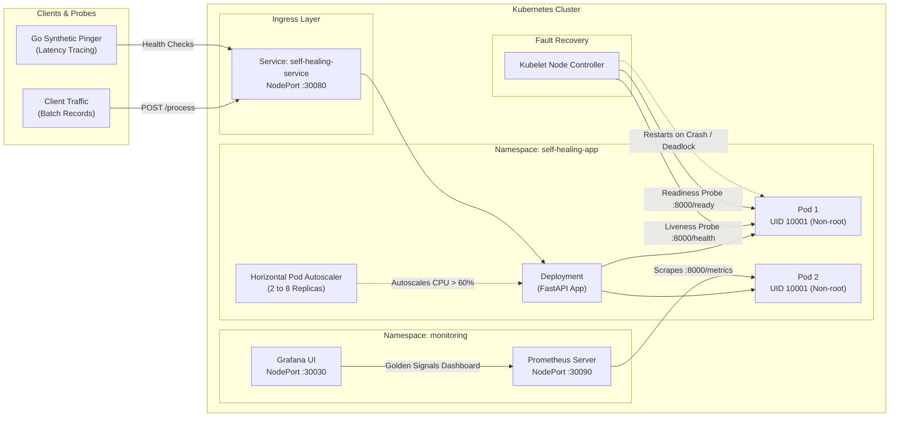

# Self-Healing Containerized Service on Kubernetes

[](https://github.com/PSaanviBhat/Self-Healing-Containerized-Service-on-Kubernetes/actions/workflows/ci.yml)
[](https://www.docker.com/)
[](https://kubernetes.io/)
[](https://www.terraform.io/)
[](https://prometheus.io/)
[](https://go.dev/)

An enterprise-ready, resilient microservice architecture designed for automated fault-recovery, horizontal scalability, and continuous observability on Kubernetes. Designed and built as a portfolio project demonstrating core SRE and Systems Engineering competencies.

---

## Architecture Diagram



---

## Key Features

1. **Resilient Data-Processing API (Python / FastAPI)**:
   - Batch ETL records ingestion (`POST /process`), schema normalization, and character/word telemetry calculation.
   - Structured JSON logging to `stdout` (`python-json-logger`).
   - Exponential backoff with jitter retry algorithm for handling downstream dependencies.
   - Dynamic chaos testing hooks (`/chaos/crash`, `/chaos/degrade`, `/chaos/recover`).
   - Unit test coverage using `pytest`.

2. **Synthetic Health Inspector (Go CLI)**:
   - Built with Go 1.22 using `net/http/httptrace`.
   - Diagnoses network timing: DNS lookup duration, TCP connection handshake, TLS timing, and total round-trip latency.
   - Parses health responses and exits with strict shell codes for automated probe scripts.

3. **Multi-Stage Containerization & Hardening**:
   - Multi-stage Docker build isolating build toolchains from runtime dependencies.
   - Drops root privileges completely, executing under dedicated user `appuser` (`UID 10001`).
   - Built-in container health check without requiring external binaries like curl or wget.

4. **Self-Healing Kubernetes Manifests**:
   - Declarative Kustomize manifests: `Deployment`, `Service`, `ConfigMap`, `HPA`.
   - Liveness probe automatically restarts unresponsive or deadlocked containers.
   - Readiness probe prevents broken containers from receiving user traffic.
   - Horizontal Pod Autoscaler targets 60% CPU utilization, dynamically scaling from 2 to 8 replicas.

5. **Infrastructure as Code (Terraform) & Host Automation (Ansible)**:
   - Modular Terraform setup supporting a local Kind cluster path at **$0 cost** and a production-ready AWS EKS path (VPC, Dual-AZ Subnets, IAM roles, Managed Node Groups).
   - Ansible playbook configuring Linux kernel prerequisites (`overlay`, `br_netfilter`), sysctl packet filtering, and base image pre-pulling.

6. **Full-Stack Observability (Prometheus & Grafana)**:
   - Prometheus server with automated pod service discovery.
   - Custom Grafana dashboard monitoring the **Four Golden Signals**: Throughput (RPS), Error Rate (5xx), P95 Latency, and Active Replicas.

7. **Automated CI/CD (GitHub Actions)**:
   - Triggers on every push to `main` and Pull Requests.
   - Executes Python and Go test suites.
   - Builds and publishes container images to GitHub Container Registry (`ghcr.io`).
   - Spins up an ephemeral Kind cluster on GitHub runners and verifies Kubernetes manifest deployment.

---

## Project Structure

```
├── .github/workflows/
│   └── ci.yml                     # GitHub Actions CI/CD Pipeline
├── app/
│   ├── main.py                    # FastAPI service, endpoints, and chaos injection
│   ├── models.py                  # Pydantic schemas
│   ├── resilience.py              # Exponential backoff retry logic
│   ├── logger.py                  # Structured JSON logger
│   ├── test_main.py               # Pytest suite
│   └── requirements.txt           # Python dependencies
├── cli/
│   ├── main.go                    # Go health check CLI tool with HTTP trace
│   ├── main_test.go               # Go test suite
│   └── go.mod                     # Go module definition
├── docker/
│   ├── Dockerfile.cli             # Static multi-stage scratch build for Go
│   └── build.sh                   # Build verification script
├── k8s/
│   ├── namespace.yaml             # Namespace definition
│   ├── configmap.yaml             # Configuration map
│   ├── deployment.yaml            # Deployment with resource limits & probes
│   ├── service.yaml               # NodePort service
│   ├── hpa.yaml                   # Horizontal Pod Autoscaler
│   ├── kustomization.yaml         # Kustomize manifest bundle
│   └── verify-self-healing.sh     # Chaos & restart verification script
├── terraform/
│   ├── main.tf                    # Root module (local vs aws routing)
│   ├── variables.tf               # Terraform variables
│   ├── outputs.tf                 # Terraform outputs
│   ├── README.md                  # Terraform documentation
│   └── modules/
│       ├── local_kind/            # Local Kind cluster module ($0 cost)
│       └── aws_eks/               # Modular AWS EKS production code
├── ansible/
│   ├── playbook.yml               # Node prep (kernel modules, sysctl, docker)
│   ├── inventory.ini              # Ansible inventory
│   └── ansible.cfg                # Ansible configuration
├── monitoring/
│   ├── namespace.yaml             # Monitoring namespace
│   ├── prometheus-config.yaml     # Scrape configuration
│   ├── prometheus-deployment.yaml # Prometheus server & RBAC
│   ├── grafana-deployment.yaml    # Grafana deployment & service
│   └── grafana-dashboard.json     # Golden Signals dashboard JSON
├── Dockerfile                     # Multi-stage non-root Python container
├── .dockerignore                  # Context exclusion file
├── RUNBOOK.md                     # On-call incident response runbook
└── README.md                      # Project documentation
```

---

## Quickstart Guide (Local Execution)

### 1. Build and Run Container Locally
```bash
# Build multi-stage image
docker build -t self-healing-k8s-service:latest .

# Run container
docker run -d -p 8000:8000 --name self-healing-app self-healing-k8s-service:latest

# Check health
curl http://localhost:8000/health
```

### 2. Deploy to Kubernetes
```bash
# Apply all manifests using Kustomize
kubectl apply -k k8s/

# Verify running pods
kubectl get pods -n self-healing-app
```

### 3. Deploy Observability Stack
```bash
kubectl apply -f monitoring/namespace.yaml
kubectl apply -f monitoring/prometheus-config.yaml
kubectl apply -f monitoring/prometheus-deployment.yaml
kubectl apply -f monitoring/grafana-deployment.yaml
```

### 4. Run the Go Health Inspector
```bash
cd cli
go run main.go -url http://localhost:8000/health
```

---

## Verifying Self-Healing

1. Inspect pod status and initial restart count:
   ```bash
   kubectl get pods -n self-healing-app
   ```
2. Trigger the chaos crash endpoint:
   ```bash
   curl -X POST http://localhost:8000/chaos/crash
   ```
3. Watch the Kubernetes kubelet detect 3 failed liveness probes and automatically restart the pod:
   ```bash
   kubectl get pods -n self-healing-app -w
   ```

Refer to [RUNBOOK.md](RUNBOOK.md) for detailed incident response, rollbacks, and operational debugging instructions.
